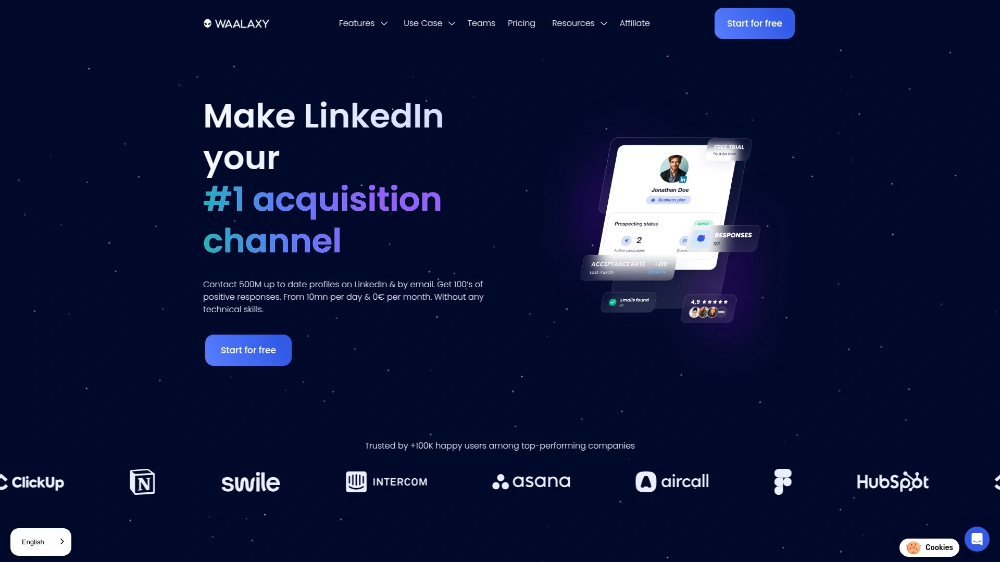
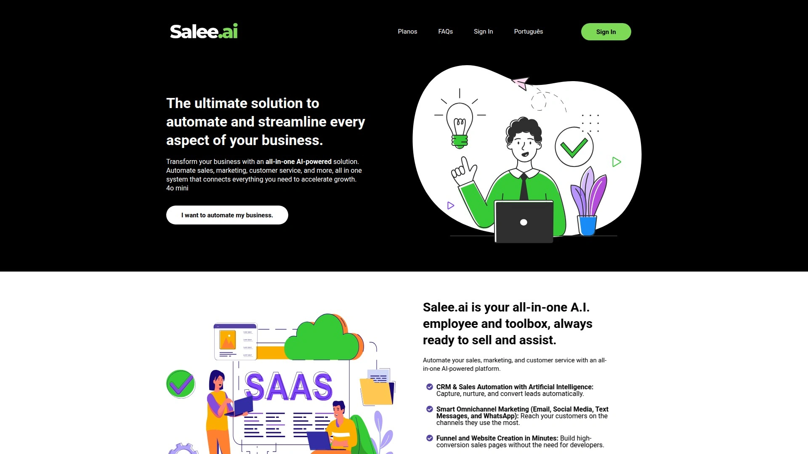

# 2025年排名前28的LinkedIn销售自动化工具完整榜单(最新整理)

如果你正在为LinkedIn上的客户开发和邮件外联发愁,每天手动发送连接请求、跟进消息累到怀疑人生,那这篇文章就是为你准备的。市面上有数十款销售自动化工具可以帮你把这些重复劳动交给系统,让你腾出时间专注在真正重要的事情上——比如跟那些已经回复你的潜在客户深入聊聊。这些工具不仅能提升外联效率,还能通过智能化的工作流和多渠道触达,让你的获客成本更可控、转化率更高。

## **[GetSales.io](https://getsales.io)**

团队协作型的云端LinkedIn和邮件双渠道自动化平台,特别适合需要多账号协同作战的场景。

GetSales最大的特色是它把"团队"这个概念放在第一位。很多同类工具只能管理单个账号,但GetSales允许你在一个工作空间里同时运行多个LinkedIn账号和邮件发件人,通过云端自动化技术绕过LinkedIn每天20个连接请求的硬性限制。它内置的统一收件箱把所有渠道的对话汇总到一起,你不用在多个标签页之间来回切换,直接在一个界面就能看到所有线索的互动历史。

这个工具特别适合代理公司、SDR团队或者需要规模化外联的企业。它提供无代码的流程构建器,你可以像搭积木一样设计自己的外联序列,比如"发送LinkedIn请求 → 等待2天 → 如果接受则发消息1 → 如果未回复则3天后发邮件"这种复杂逻辑都能轻松实现。平台还支持ABM(基于账户的营销)策略,让你能对高价值目标客户做精准的个性化触达。定价从每月59美元起步,对于需要多账号管理和团队协作功能的用户来说性价比很高。

## **[HeyReach](https://www.heyreach.io)**

专为线索开发和招聘代理公司打造的多发件人LinkedIn自动化工具。

HeyReach解决的核心痛点是LinkedIn的每日连接限制。它允许你在同一个外联序列中同步多个LinkedIn账号,系统会自动轮换发件人来最大化外联量,同时保证每个账号都在安全阈值内。比如你有5个LinkedIn账号,每个账号每天能发20个请求,那HeyReach就能帮你每天触达100个新线索,而不是只有20个。

统一收件箱功能把所有账号的对话合并到一个界面,你可以代表团队任何成员回复消息,不需要反复登录登出。列表操作功能特别聪明,它能交叉匹配不同条件创建高度精准的线索列表,比如"参加了某个活动且是某个群组成员"这种复杂筛选。标准套餐79美元/席位/月,包含所有功能且不限使用量,14天试用期提供3个席位无需信用卡。如果是代理公司,799美元/月可管理最多50个账号和5个工作空间。

## **[Expandi](https://expandi.io)**

企业级安全标准的LinkedIn自动化工具,以动态个性化和独立IP著称。

Expandi的核心卖点是**安全性**。每个用户都会获得专属的本地IP地址,确保你的LinkedIn登录位置始终保持一致,这大大降低了账号被标记的风险。它的Smart Inbox智能收件箱解决了LinkedIn原生消息界面的各种痛点,让多账号管理和客户互动变得更顺畅。

动态个性化功能不只是简单地插入名字或公司名,它能根据线索的个人资料、行业、职位等多维度信息生成真正个性化的消息,这直接提升了回复率。Webhooks集成让你能连接Zapier和其他营销工具,打造全渠道增长策略。定价从99美元/席位/月起,提供7天免费试用。适合增长黑客、代理公司老板以及管理多个LinkedIn账号的专业人士。

## **[Skylead](https://www.skylead.io)**

结合LinkedIn和邮件的智能序列工具,擅长通过条件逻辑建立强关系。

Skylead最大的亮点是**智能序列**功能。你可以设置基于用户行为的条件逻辑,比如"如果对方打开了邮件但没回复,3天后发LinkedIn消息;如果LinkedIn请求被接受,立即发送第一封跟进邮件"。这种多渠道、多触点的自动化大幅提升了转化机会。

它的Drip Campaign功能可以向所有三度人脉发送个性化邀请,而Smart Reply Detection会在收到回复后自动停止后续消息,避免打扰已经互动的线索。轻量级CRM和Smart Inbox把LinkedIn和邮件管理整合在一起,让你能聚焦在最有价值的线索上。云端架构提供专属IP,无需在本地电脑保持登录。All-in-One套餐100美元/账号/月,包含多用户支持和7×24小时在线客服。

## **[Waalaxy](https://www.waalaxy.com)**

对新手超友好的Chrome扩展程序,适合中小团队的多渠道线索开发。

Waalaxy的最大优势是**入门门槛低**。作为浏览器插件,它安装后就能直接在LinkedIn界面上使用,不需要复杂的配置。它支持LinkedIn和邮件的多渠道自动化,每周最多可发送200个LinkedIn邀请,在合规性和外联量之间取得了不错的平衡。

高级自动化功能包括跟进消息自动化和新线索自动导入,提升了线索管理效率。无缝的CRM集成让你能顺畅地运行LinkedIn营销活动。云端解决方案配备预填充的消息模板,方便快速启动。Business套餐160欧元/月包含LinkedIn和邮件功能、800个邀请/月、500个邮箱查找积分以及全面的CRM同步。还有免费套餐可以试用基础功能。

## **[Apollo.io](https://www.apollo.io)**

从B2B联系人数据库起家,现在是全栈式AI销售平台。

Apollo最近从单纯的数据工具升级成了完整的销售平台。它的核心优势仍然是庞大且准确的B2B联系人数据库,这让AI协作功能和自动化工具有了坚实的数据基础。新推出的GTM平台将战略、管道和增长统一起来,还有下一代CRM平台即将上线。

AI副驾驶功能可以辅助团队成员工作,甚至完全自动化冷外联和邮件营销活动。对于需要统一技术栈和客户数据的团队来说,Apollo提供了更多功能和工具。免费套餐可用,付费套餐从59美元/用户/月起(年付)。不过新增的功能可能与你现有的销售工具重复,而且无法单独选择特定服务。

## **[HubSpot Sales Hub](https://www.hubspot.com/products/sales)**

市场认可度最高的CRM和销售自动化组合平台之一。

HubSpot Sales Hub就像Salesforce一样,是销售自动化领域的老牌玩家。它把CRM平台和销售自动化工具紧密整合,提供线索管理、邮件自动化和自动销售报告等核心功能。这些功能与CRM深度集成,让工作流程尽可能顺畅。

销售分析和报告功能帮你追踪关键指标,会议调度器简化了约会安排,对话智能功能则能从销售通话中提取洞察。表单构建器和广告跟踪管理对于营销和销售协同特别有用。定价从免费到每月1200美元不等(Sales Hub),营销套餐则是17到3000英镑/月。适合需要强大CRM支撑和全面销售工具的企业。

## **[Instantly.ai](https://instantly.ai)**

主打简洁易用的冷邮件外联平台,支持无限邮箱账号。

Instantly最大的卖点是**无限邮箱账号**。这意味着你可以创建大规模营销活动而不用担心额外费用。它专注于自动化关键任务,比如邮箱预热和多变量测试,让你不会被用不到的功能淹没。

自动邮件序列、声誉保护工具和A/Z测试(多变量测试)是核心功能。线索发现和内置CRM作为可选附加项,让你可以只为需要的功能付费。邮箱预热和发送计划从30美元/月起(年付),77.60美元/月解锁高级预热和多变量测试。线索发现单独定价37.90美元/月起,CRM附加项47美元/月起。有用户反馈预热效果可能不如预期,且平台缺少API。

## **[Salesloop.io](https://salesloop.io)**

多渠道销售互动平台,强调精准定位和个性化消息。

Salesloop专注于**B2B线索开发和营销活动工作流自动化**。无论你是单打独斗的销售、成长中的团队、管理多客户的代理公司,还是需要全托管方案的企业,它都能提供相应的工具和灵活性。

精准定位是它的强项,你可以快速上传CSV文件或连接多个意向数据源,按职位、行业等标准识别和细分理想客户。平台支持创建高度个性化、价值驱动的消息序列,而不是千篇一律的模板邮件。自动取消注册功能确保线索回复后不会被重复打扰,高级的基于角色的个性化让你能规模化定制消息。目前主要渠道是邮件,但Twitter和电话集成即将上线。

## **[SalesLoft](https://salesloft.com)**

顶级销售互动平台,整合销售节奏、对话智能和收入分析。

SalesLoft将销售工具整合在一个统一系统里,包括销售节奏自动化、对话智能和收入分析。这让从单个销售代表到大型企业的团队都能在销售流程的每个阶段更有效地与潜在买家建立联系。

强大的节奏构建器允许团队自动化多渠道外联序列,涵盖邮件、电话、社交媒体甚至短信。对话智能功能通过记录和分析销售通话,帮助团队洞察买家行为并识别成功的对话策略。销售经理可以利用这个功能提供有针对性的辅导,提升整体团队表现。Prospect和Enterprise套餐的定价未公开,需要直接联系获取报价。

## **[Lemlist](https://lemlist.com)**

冷邮件自动化专家,集成LinkedIn功能的多渠道外联工具。

Lemlist是云端多渠道外联平台,将LinkedIn操作整合到邮件序列中。它的核心优势在于**冷邮件自动化**和AI驱动的线索定位。自动跟进序列确保及时互动以获得最大参与度。

邮箱预热工具改善送达率并保持高回复率,这对冷邮件营销至关重要。B2B数据库访问功能让你用高级筛选器在大型数据库中找到新买家。AI营销活动生成器能快速生成个性化营销活动。冷邮件自动化套餐59美元/月,冷邮件+LinkedIn套餐99美元/月,企业套餐需定制报价。邮箱预热单独29美元/月。

## **[Zopto](https://zopto.com)**

云端线索开发软件,通过多触点智能工作流简化LinkedIn和邮件外联。

Zopto提供高级筛选器来精准定位理想客户,仪表板可追踪线索和营销活动统计数据。可自定义的互动级别涵盖连接邀请、消息序列、InMail等。多渠道外联包括LinkedIn消息、InMail、邮件和Twitter消息。

GPT-3集成利用AI制作个性化消息模板。CRM集成允许与现有CRM系统无缝对接。它还能帮你改善LinkedIn互动,通过排期发帖保持内容一致性,AI生成器帮你创作吸引人的文案。Personal套餐195美元/月,Grow套餐312美元/月,Agency套餐780美元/月。价格偏高且没有免费试用,但功能全面。

## **[Dripify](https://dripify.io)**

专为销售团队设计的多功能云端LinkedIn自动化软件,擅长滴灌营销活动。

Dripify让你设置销售漏斗并执行滴灌营销活动。因为是云端方案,即使设备关机也能完全自动化运行。Drip Campaign功能支持用各种LinkedIn操作创建有效的销售漏斗。

高级分析工具帮你追踪和评估营销活动表现及转化率。线索响应功能用定制模式自动回复收到的消息。团队管理功能通过控制面板实时监控团队成员的统计数据。安全算法确保高级别的LinkedIn账号安全。Basic套餐39美元/月,Pro套餐59美元/月,Advanced套餐79美元/月提供全部功能和分析。

## **[PhantomBuster](https://phantombuster.com)**

无代码自动化和数据提取工具,覆盖LinkedIn、Instagram、Twitter等多平台。

PhantomBuster的核心是**数据提取**。LinkedIn Network Booster自动发送邀请并与LinkedIn用户列表建立连接。LinkedIn Data Enrichment从LinkedIn个人资料收集姓名、职位、职位等数据。LinkedIn Message Sender自动发送个性化消息给LinkedIn连接。

LinkedIn Auto Commenter/Liker自动与连接和其他LinkedIn用户的帖子互动。它还能收集LinkedIn个人资料信息、自动连接用户并导出资料。快速获取和改进线索数据,连接到CRM系统并与Google Sheets保持同步。14天免费试用,Starter套餐69美元/月(20小时自动化),Pro套餐159美元/月(80小时),Team套餐439美元/月(300小时)。有学习曲线,不是所有功能都对新手友好。

## **[Octopus CRM](https://octopuscrm.io)**

性价比高的一体化LinkedIn自动化方案,适合预算有限的代理公司和招聘团队。

Octopus CRM简化LinkedIn上的外联和线索开发任务,让你创建营销漏斗、自动化连接请求、发送个性化消息、技能背书等。Drip Campaign自动化一系列LinkedIn操作以创建有效的营销漏斗。

高级分析监控关键指标以评估和改进营销活动表现。线索响应为收到的消息定制回复以实现个性化互动。团队管理功能实时管理团队成员并监控绩效。Starter套餐9.99美元/月,Pro套餐14.99美元/月,Advanced套餐21.99美元/月,Unlimited套餐39.99美元/月。适合寻找性价比方案的营销代理、招聘人员和销售团队。

## **[Reply.io](https://reply.io)**

云端多渠道外联工具,支持网页爬取、WhatsApp和SMS等即时通讯渠道。

Reply设计用于增强销售和营销专业人士的沟通渠道。网页爬取功能提取潜在客户的邮箱和电话号码。即时通讯支持通过WhatsApp和SMS进行沟通。多渠道序列通过LinkedIn、邮件和社交媒体消息与联系人互动。

高级分析提供洞察仪表板追踪LinkedIn自动化结果。AI助手发送定制的、类人消息以提高回复率。协作环境集中LinkedIn操作以实现有效的团队协作。邮箱预热功能防止垃圾邮件处罚。Free套餐提供200数据积分/月,Starter套餐60美元/月,Professional套餐90美元/月,Custom套餐需联系销售团队。

## **[La Growth Machine](https://lagrowthmachine.com)**

多渠道外联自动化工具,整合LinkedIn、邮件和Twitter DM。

La Growth Machine设计用于线索开发和互动,能设计利用LinkedIn消息、冷邮件和Twitter私信的营销活动。多渠道工作流在LinkedIn、邮件和Twitter上吸引线索。线索富化自动查找缺失信息并充实联系人详情。

线索管理功能有效导入、细分和管理线索。绩效分析追踪外联营销活动的有效性。集成能力与各种CRM工具和平台无缝对接。所有套餐提供14天免费试用,Basic套餐50美元/月,Pro套餐100美元/月,Ultimate套餐150美元/月。适合寻求高效多渠道外联的营销人员、销售团队和企业。

## **[MeetAlfred](https://meetalfred.com)**

多功能LinkedIn自动化软件,专注端到端社交销售营销活动。

MeetAlfred(前身Leonard)简化团队管理、构建LinkedIn营销活动和自动化外联序列。Campaign Manager支持创建和管理LinkedIn消息序列,带个性化标签和操作限制。Alfred CRM是工具内置的CRM系统,用于高效管理线索和连接。

邮件营销活动序列通过与GSuite集成将外联扩展到LinkedIn之外。实时分析提供可操作洞察的仪表板来监控进度和优化策略。Personal套餐59美元/月包含3个活动、基础CRM和多渠道自动化;Business套餐89美元/月包含无限营销活动和高级功能;Enterprise套餐345美元/月包含5个用户(额外用户69美元/月)。

## **[LinkedHelper](https://www.linkedhelper.com)**

简化在LinkedIn上寻找目标B2B线索的工具,帮你扩展网络并自动化线索开发漏斗。

LinkedHelper让你拓展网络、创建智能消息链、管理联系人并自动化LinkedIn线索开发漏斗。LinkedIn自动回复器用可自定义模板自动化向二度和三度联系人的外联营销活动。

向LinkedIn群组成员发消息功能让你与所属群组的成员互动,即使他们是二度或三度联系人。管理LinkedIn联系人功能导入自定义CSV结果以进行定向外联。14天免费试用,Standard套餐15美元/月,Pro套餐45美元/月包含高级功能和无限营销活动。提前支付3、6或12个月可享受高达45%折扣。

## **[Dux-Soup](https://www.dux-soup.com)**

市场上最受欢迎的LinkedIn线索开发工具之一,以Chrome扩展形式运行。

Dux-Soup在LinkedIn自动化工具市场占据一席之地,以易于连接和吸引潜在客户而闻名。作为Chrome扩展程序独树一帜,直接在浏览器内运行,需要LinkedIn保持打开状态才能激活功能。

管理潜在客户功能允许你在LinkedIn个人资料上留下笔记和标签。下载个人资料详情便于提取LinkedIn个人资料信息以无缝集成到CRM。外联和自动化提供自动访问个人资料、发送个性化消息和技能背书等功能。Pro Dux套餐14.99美元/月,Turbo Dux套餐55美元/月,Cloud Dux套餐99美元/月提供云端全天候运行。

## **[We-Connect](https://we-connect.io)**

云端LinkedIn自动化软件,简化LinkedIn上的线索开发、培育和成交流程。

We-Connect的强大Campaign Manager支持设置和运行针对自定义受众的多个营销活动。智能回复管理将所有潜在客户互动集中在一个地方以实现高效沟通。简单的用户管理功能在账户内添加用户并从统一仪表板提供全面的营销活动报告。

增强的安全功能包括专用IP地址、操作之间的随机延迟和自动重复抑制。直观的Smart Sequence在一个营销活动中自动化一系列操作,如个人资料访问、帖子点赞和跟进。单一套餐49美元/月,包含AI摘要、Smart Sequence、BYOIP、LinkedIn事件、A/B测试等。

## **[Salesflow](https://salesflow.io)**

为希望用AI驱动工具填充销售漏斗的团队设计的LinkedIn自动化工具。

Salesflow提供一套功能,不仅吸引线索还能通过AI驱动工具高效管理它们。多营销活动创建和排期功能定制和排期各种营销活动以有效针对不同市场细分。潜在客户搜索筛选用复杂的筛选选项精确定位理想潜在客户。

个性化营销活动消息制作与每个细分产生共鸣的消息,增强外联中的个人触感。无限跟进消息设置尽可能多的跟进以最大化回复率和增加预约。智能可自定义收件箱配备AI回复检测、高级筛选器和标签,用于高效的线索管理。定价从99美元/月起。

## **[LiProspect](https://liprospect.com)**

云端全自动外联和跟进系统,是LinkedIn线索开发工具的理想选择。

LiProspect带来个性化跟进、智能收件箱和高级搜索功能的独特组合,所有这些都旨在最大化线索开发和营销活动效率。云端能力无需安装,完全基于云运行。Sales Navigator导入利用高级搜索筛选器进行LinkedIn线索开发。

自定义导入通过简单的联系人导入快速激活外联营销活动。Smart Inbox用直观、功能丰富的收件箱管理回复。黑名单管理轻松排除选定账户。专用4G移动代理为每个账户提供银行级安全性。仅提供Business套餐,起价89美元/月。

## **[Linked Radar](https://linkedradar.com)**

专注于通过个性化模板和云端自动化连接潜在客户的LinkedIn工具。

Linked Radar的个性化模板由LinkedIn专家制作以增强互动。自动化消息使用定制消息模板提高回复率。时区管理调整活动时间以与潜在客户的活跃时间保持一致。

智能限制将邀请和消息限制为每天100个,防止账号被封。云端架构确保持续运行,即使用户电脑关机。模仿人类行为通过模拟真实用户行为来降低风险。Start套餐14.9美元/月,Biz套餐24.9美元/月,Pro套餐69.9美元/月,Team套餐99.9美元/月,每个套餐都有30天免费试用。

## **[LeadConnect](https://leadconnect.io)**

帮你准确定义目标受众并自动发送多达100条自定义邀请消息的LinkedIn工具。

LeadConnect让你准确定义目标受众,为个性化消息奠定基础,并自动向潜在客户发送多达100条自定义邀请消息。外联消息模板促进个性化消息以有效吸引潜在客户。团队黑名单防止团队成员重复外联,提高营销活动效率。

联系人数据库集中你的目标受众数据以便于访问和管理。CRM链接与Hubspot等CRM无缝集成以实现有效的线索培育。活动追踪自动监控LinkedIn相关变化和潜在客户回复。Free Forever套餐0美元/月,Professional套餐22.95美元/月,Grow套餐40.95美元/月,Ultimate套餐77.95美元/月。

## **[LinkedFusion](https://linkedfusion.com)**

强调顶级安全性的LinkedIn自动化工具,提供专属独享IP以实现更稳定安全的连接。

LinkedFusion与Google Sheets、Zapier和Hubspot等平台无缝集成。它强调顶级安全性,为用户提供专用独享IP以实现更稳定安全的客户端-服务器连接,确保更顺畅的自动化流程。

云端存储确保数据的轻松传输、管理和保护。队友功能自动向队友发送连接请求。客户支持提供全面的销售和技术支持,无需额外费用。智能收件箱为高效的聊天筛选标记对话。图形分析提供仪表板来追踪和管理外联潜力。14天免费试用,Standard套餐15美元/月,Pro套餐45美元/月。

## **[SaleeAI](https://salee.ai)**

AI驱动的消息生成LinkedIn外联工具,专注于创建个性化破冰话题和销售消息。

SaleeAI分析线索的LinkedIn个人资料,考虑他们的公司、行业、痛点和目标,创建高度相关且吸引人的消息。AI生成的破冰话题为每个线索创建独特、吸引人的开场白。自然语气重新措辞将销售消息精炼得听起来更像对话和人性化。

定制回复生成根据线索之前的互动和特定目标量身定制的回复,培养更有意义的连接。线索验证采用先进的AI验证线索真实性,通过智能消息有效地将回复率翻倍。Solo套餐25美元/月,Quintet套餐99美元/月(最多5个席位),Ensemble套餐179美元/月(最多10个席位),Symphony套餐定制定价。

## **[Demand (formerly Saleshub)](https://usedemand.com)**

专注于个性化的LinkedIn自动化工具,确保自动化消息也能保持针对性。

Demand(前身Saleshub)作为专注于个性化的动态工具脱颖而出,确保你的消息不仅是自动化的,而且为每个接收者量身定制,增强互动和回复率。双重验证邮箱采用强大的双重验证系统确保邮件联系人的真实性和质量。

统一收件箱无缝整合LinkedIn和邮件,将帖子回复直接导入你的CRM,简化沟通流程。访客追踪识别实时网站访客,提供关于受众的有价值洞察。Slack集成用专门的Slack频道追踪和报告LinkedIn活动,确保你始终了解最新情况。Sales Acceleration和Social Selling套餐各59美元/用户/月,All-In-One套餐99美元/用户/月。

## **[Cirrus Insight](https://www.cirrusinsight.com)**

专为Gmail和Outlook设计的销售赋能插件,以与Salesforce的卓越集成而闻名。

Cirrus Insight成立于2011年,为需要工作流程效率和精准度的销售人员量身定制。这个销售赋能平台提供无缝的一体化销售生产力解决方案,拥有卓越的Salesforce集成。

Salesforce集成直接与Salesforce同步,支持收件箱内更新和数据记录。邮件和日历事件追踪自动同步邮件、事件和任务以获得更好的洞察和报告。个性化外联的Cadence功能为潜在客户构建定制的沟通时间线。高级日历排期功能包括团队排期和自定义会前问题,所有内容都记录在Salesforce中。Salesforce Sync套餐14美元/用户/月,Pro套餐21美元/用户/月,Expert套餐49美元/用户/月。

## 常见问题

**这些LinkedIn自动化工具会不会导致账号被封?**

只要选择合规的工具并遵循LinkedIn的使用限制,风险是可控的。云端工具(如HeyReach、Expandi)通常比浏览器插件更安全,因为它们提供专属IP和人类行为模拟功能。建议避免每天发送超过100个连接请求,消息也要保持个性化而非明显的批量模板。

**如何选择适合团队规模的工具?**

单人或小团队可以从Waalaxy、Dux-Soup这类入门级工具开始,它们价格友好且功能够用。如果是5人以上的销售团队或代理公司,需要多账号管理和统一收件箱功能的工具(如GetSales、HeyReach)会更高效。大型企业应该考虑SalesLoft、HubSpot这类能与现有CRM深度集成的企业级方案。

**邮件外联和LinkedIn自动化哪个效果更好?**

两者结合效果最佳。LinkedIn适合建立初始连接和建立信任关系,而邮件则更适合发送详细的价值主张和后续跟进。像Skylead、La Growth Machine这类多渠道工具能让你设计"LinkedIn邀请 → 接受后发LinkedIn消息 → 3天后发邮件跟进"这种组合拳,覆盖不同的触达场景。

## 结语

从线索开发到客户转化,选对自动化工具能让你的效率提升数倍。如果你正在管理多个LinkedIn账号,或者团队需要协同作战,[GetSales.io](https://getsales.io)的云端多账号管理和统一收件箱功能特别适合需要规模化外联且重视团队协作的场景。选择工具时记得先明确自己的核心需求——是单纯的LinkedIn自动化、还是需要邮件集成、或是要深度CRM对接——然后从免费试用开始测试,找到最契合业务流程的那一款。
